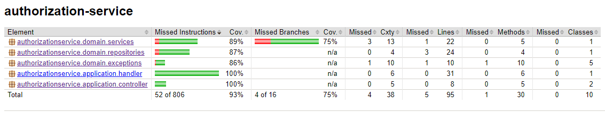

# Authorization Service

This is a project about an authorization and authentication service, with user session control

## Getting started

For our application it will be necessary a mongodb database and a network, for that it is enough to go up the docker compose that I made available in the project

Use the command below to raise the containers
```
docker-compose up
```

Use the command below to start the aplication

```
mvn run
```

After starting the application you can check its version at the endpoint:

```
http://localhost:8080/healthcheck
```

The request response should look something like this:

<h1 align="center">
  
</h1>

To run the unit tests just run

```
mvn mvn test
```

After running the tests the test report generated by the jacoco can be verified in the directory (target/site/jacoco/index.html)

<h1 align="center">
  
</h1>

In case you want to check and use the routes I make available the [collection](/collection/[AS]AUTHORIZATION-SERVICE.postman_collection.json) and its [variables](/collection/[AS]AUTHORIZATION-LOCAL.postman_environment.json)

## Built With

* [Kotlin](https://kotlinlang.org/) - The programming language that does more with less code
* [SpringBoot](https://spring.io/projects/spring-boot/) - A lightweight web framework for Java and Kotlin
* [MongoDB](https://www.mongodb.com/) - NoSQL document based database
* [Maven](https://gradle.org/) - More than just a building toolkit
* [Redis](https://redis.io/) - In-memory database
* [Jwt](https://jwt.io/) - Jwt token